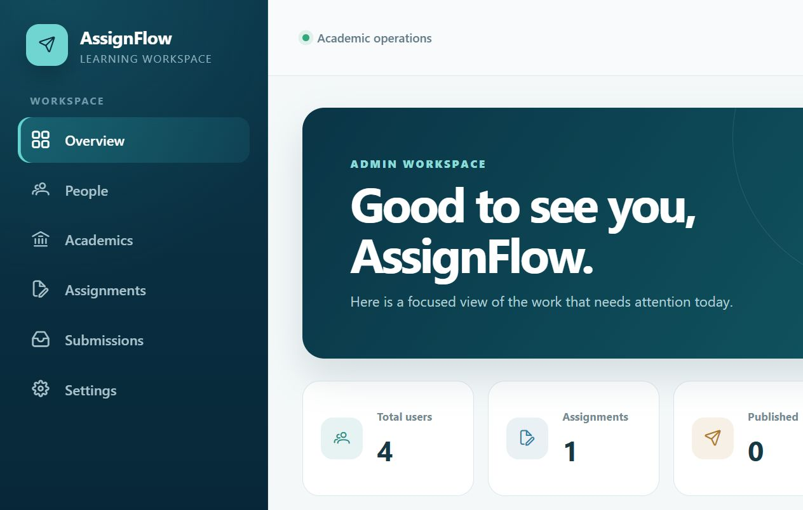
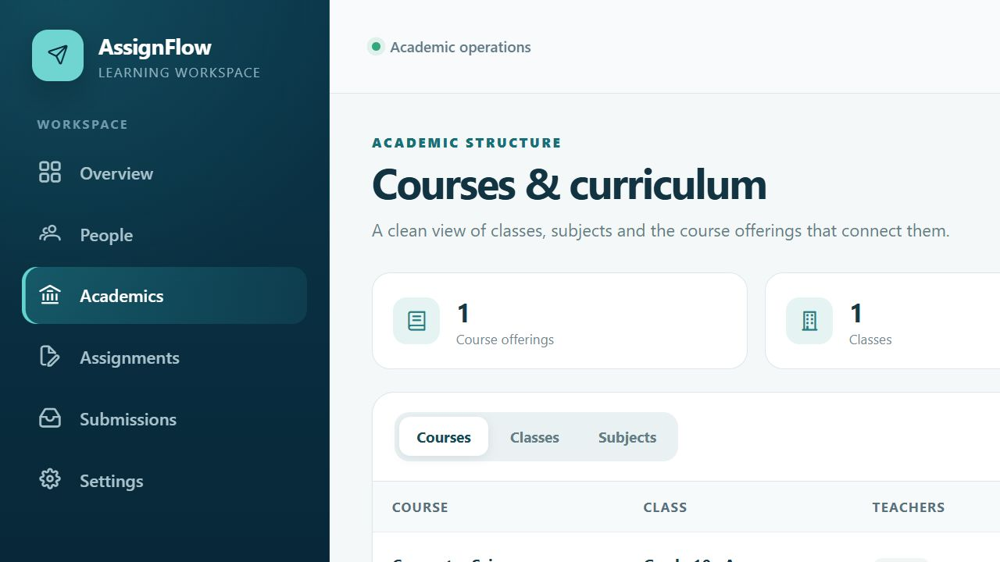
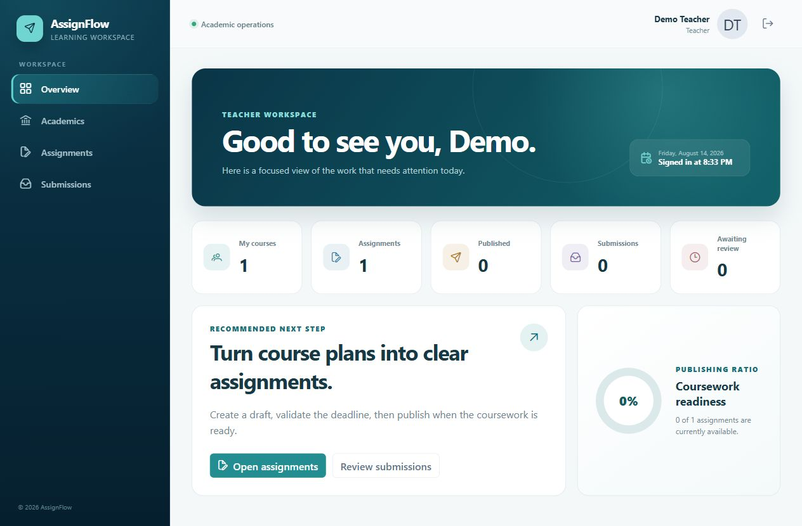
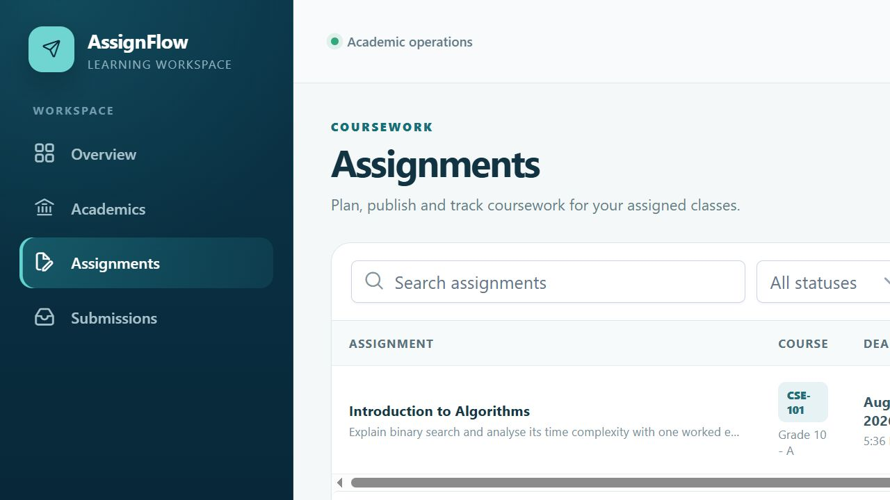
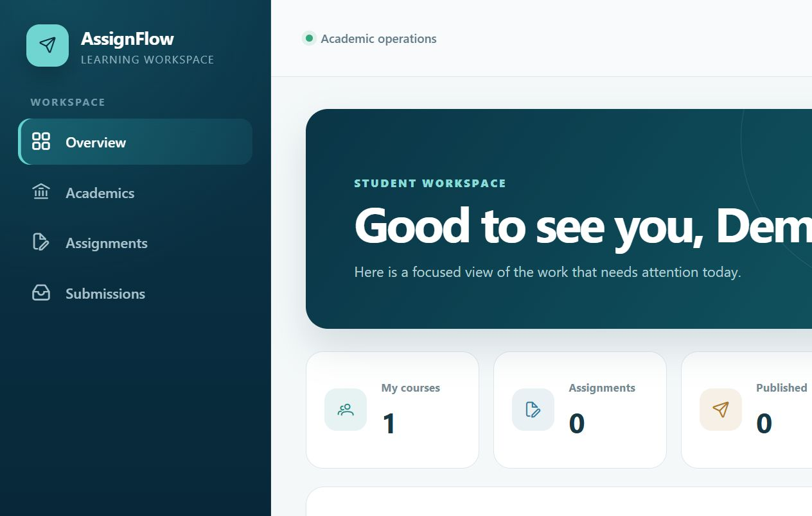
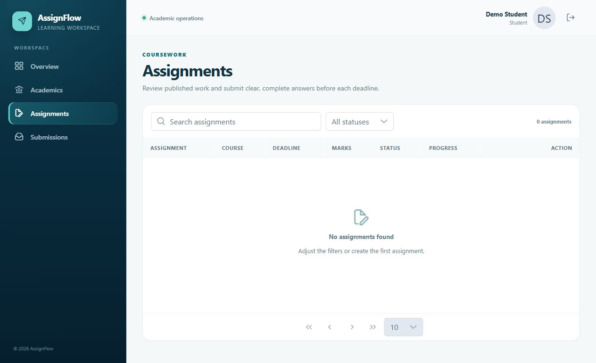

<div align="center">

# AssignFlow

### Assignment & Submission Management System

A secure, role-based academic workspace for planning coursework, managing submissions, and delivering meaningful feedback.


[Features](#role-based-experience) · [Architecture](#architecture) · [Quick start](#quick-start) · [Demo accounts](#demo-accounts) · [Tests](#testing)

</div>



## Overview

AssignFlow is a full-stack school and college application that connects Admin, Teacher, and Student workflows through one governed assignment lifecycle. It combines a .NET 10 REST API, PostgreSQL, ASP.NET Core Identity, JWT authorization, and a responsive Angular 21 standalone client.

### Highlights

- Strict backend role authorization with service-level ownership checks.
- Complete academic structure: classes, subjects, course offerings, teachers, and enrollments.
- Draft, publish, archive, update, and safe-delete assignment workflows.
- Deadline-enforced submission and controlled resubmission.
- Marks, feedback, review statuses, pagination, filtering, and role-aware dashboards.
- FluentValidation, structured error responses, logging, Swagger/OpenAPI, migrations, seed data, Docker, and automated tests.
- Optimized EF Core projections and database-side queries for predictable performance.

## Role-based experience

### Admin

Admin users govern people, academic structure, course access, application settings, and system-wide assignment/submission visibility.

- Create and update Admin, Teacher, and Student accounts.
- Manage classes, subjects, and course offerings.
- Assign teachers and enroll students.
- Safely delete unused academic records with dependency protection.
- View all assignments and submissions without taking over Teacher-owned workflows.

<p align="center">
  
  
</p>

### Teacher

Teachers work only within their assigned courses and control the complete assignment and review lifecycle.

- Create, edit, publish, archive, and safely delete assignments.
- Define title, description, deadline, maximum marks, and resubmission policy.
- Review student submissions, assign marks, provide feedback, and update status.
- View role-scoped course, assignment, and submission summaries.

<p align="center">
  
  
</p>

### Student

Students receive a focused view of published assignments for courses in which they are enrolled.

- View assignment details, requirements, marks, and deadlines.
- Submit an answer before the deadline.
- Update an eligible submission when resubmission is allowed.
- Track submission status, marks, and Teacher feedback.

<p align="center">
  
  
</p>

## Requirement coverage

| Area | Implementation | Status |
|---|---|:---:|
| Authentication | Login, JWT validation, active-account enforcement | ✅ |
| Authorization | Controller role policies plus service ownership checks | ✅ |
| Admin workflow | Users, academics, access, settings, global visibility | ✅ |
| Teacher workflow | Assignment CRUD, publishing, review, marks, feedback | ✅ |
| Student workflow | Scoped discovery, submit/update, result visibility | ✅ |
| Backend | .NET 10, REST, validation, middleware, logging, Swagger | ✅ |
| Frontend | Angular 21, TypeScript strict mode, responsive PrimeNG UI | ✅ |
| Database | PostgreSQL relationships, indexes, migrations, SQL script | ✅ |
| Testing | Authorization, academic deletion, assignment and submission rules | ✅ |
| Delivery | Docker, environment example, seed data, setup documentation | ✅ |

## Architecture

The solution follows the requested CRAB-style layered flow while keeping entity, DTO, service, and repository responsibilities separate.

```text
AssignFlow.UI
    │  HTTPS + JWT
    ▼
AssignFlow.API
    │  Controllers · Validation · Middleware
    ▼
AssignFlow.Services
    │  Business rules · Authorization · Transactions
    ▼
AssignFlow.DataAccess
    │  Repositories · Projection · Pagination
    ▼
AssignFlow.Domain
    │  Entities · Identity · EF Core migrations
    ▼
PostgreSQL
```

| Project | Responsibility |
|---|---|
| `AssignFlow.API` | Controllers, middleware, validators, JWT/Swagger configuration, and seed orchestration |
| `AssignFlow.Services` | Business services, workflow rules, ownership checks, and service registration |
| `AssignFlow.DataAccess` | Repository contracts, optimized EF Core queries, and data registration |
| `AssignFlow.Domain` | Standalone entities, relationships, indexes, `AppDbContext`, and migrations |
| `AssignFlow.Models` | Standalone request/response DTO classes and pagination contracts |
| `AssignFlow.Utils` | Role constants and typed application exceptions |
| `AssignFlow.UI` | Angular standalone screens, guards, interceptors, services, signals, and PrimeNG design system |
| `AssignFlow.Tests` | Authorization and high-risk business-rule tests |

## Technology stack

| Layer | Technologies |
|---|---|
| Frontend | Angular 21, TypeScript, standalone components, signals, RxJS, reactive forms, PrimeNG 21 |
| Backend | .NET 10, ASP.NET Core Web API, C#, FluentValidation, Swagger/OpenAPI |
| Security | ASP.NET Core Identity, JWT Bearer authentication, role authorization |
| Data | PostgreSQL, Entity Framework Core, migrations, optimized LINQ projections |
| Quality | xUnit, EF Core InMemory, strict templates, production Angular build |
| Delivery | Docker, Docker Compose, Nginx static hosting, environment-based configuration |

## Performance and data integrity

- Hot lists use `AsNoTracking()`, server-side projection, filtering, ordering, and pagination.
- Page size is capped at 100; endpoints do not load unbounded collections.
- Existence and dependency checks use database-side `AnyAsync()` queries.
- Composite and unique indexes protect common filters and core invariants.
- Enrollment, Teacher mapping, subject code, course offering, and Student submission uniqueness are database-enforced.
- Academic delete operations reject records with protected dependencies instead of cascading into important coursework.
- Async APIs accept cancellation tokens from controller to database.

## Project structure

```text
AssignFlow/
├── AssignFlow.API/          # HTTP API, auth, validation, Swagger, seeding
├── AssignFlow.Services/     # Business rules and service interfaces
├── AssignFlow.DataAccess/   # Repository interfaces and implementations
├── AssignFlow.Domain/       # Entities, DbContext, indexes, migrations
├── AssignFlow.Models/       # Standalone DTO classes
├── AssignFlow.Utils/        # Constants and application exceptions
├── AssignFlow.UI/           # Angular 21 standalone application
├── tests/AssignFlow.Tests/  # Automated business and authorization tests
├── database/                # Idempotent PostgreSQL setup script
├── docs/screenshots/        # Role-wise product screenshots
└── docker-compose.yml       # Local full-stack environment
```

## Quick start

### Prerequisites

- .NET SDK 10
- Node.js 22 or 24 and npm
- PostgreSQL 17 or newer compatible version
- Docker Desktop, optionally

### Option 1: Docker Compose

```bash
cp .env.example .env
docker compose up --build
```

| Service | URL |
|---|---|
| Web application | `http://localhost:4200` |
| Swagger | `http://localhost:8080/swagger` |
| Health check | `http://localhost:8080/health` |

The Development container applies migrations and inserts evaluation data after PostgreSQL becomes healthy.

### Option 2: Visual Studio + Angular CLI

1. Create a PostgreSQL database named `assignflow`.
2. Copy `AssignFlow.API/appsettings.Local.example.json` to `AssignFlow.API/appsettings.Local.json`.
3. Enter the local PostgreSQL credentials and a JWT key containing at least 32 characters.
4. Open `AssignFlow.slnx`, set `AssignFlow.API` as startup project, select **IIS Express**, and run.
5. Start the Angular application:

```powershell
cd AssignFlow.UI
npm install
ng serve
```

Open `http://localhost:4200`. Swagger runs at `https://localhost:44383/swagger/index.html`.

### Database migration

```powershell
dotnet ef database update --project AssignFlow.Domain --startup-project AssignFlow.API
```

The evaluator can also use `database/assignflow-initial.sql`; no table needs to be created manually.

## Demo accounts

Demo seeding is enabled only for local Development/evaluation. These are not production credentials.

| Role | Email | Password |
|---|---|---|
| Admin | `mzhr.riad@gmail.com` | `12345678` |
| Teacher | `teacher@assignflow.local` | `AssignFlow@123` |
| Student | `student@assignflow.local` | `AssignFlow@123` |

After the first successful seed, set `Seed:Enabled` to `false` when demo accounts are no longer required.

## Main API routes

| Area | Route |
|---|---|
| Authentication | `POST /api/auth/login`, `GET /api/auth/me` |
| Users and settings | `/api/admin/users`, `/api/admin/settings` |
| Classes, subjects, courses | `/api/academic/*` |
| Assignments | `/api/assignments` |
| Submissions and grading | `/api/submissions` |
| Dashboard | `GET /api/dashboard/summary` |

Use `Bearer <access-token>` in Swagger after calling the login endpoint.

## Business rules

- Only a Teacher assigned to a course can create or manage its assignments.
- Students see only published assignments for their enrolled courses.
- Published assignments require a future deadline.
- Submissions are rejected after the deadline.
- A second submission requires `AllowResubmission=true` and cannot replace a graded submission.
- Marks must remain between zero and the assignment maximum.
- Only draft assignments without submissions can be deleted.
- Archived assignments cannot be reopened.
- Classes and subjects with course offerings cannot be deleted.
- Course offerings with assignments cannot be deleted.

## Testing

```powershell
dotnet test AssignFlow.slnx --configuration Release
```

Current result: **18 passed, 0 failed**.

The suite covers controller role policies, assigned-Teacher authorization, Admin authoring restrictions, protected academic deletion, enrollment checks, deadline enforcement, controlled resubmission, and maximum-mark validation.

Frontend production verification:

```powershell
cd AssignFlow.UI
npm run build
```

## Assumptions

- Angular 21 was selected at the requester's direction; required TypeScript, responsiveness, validation, and API integration remain fully implemented.
- A course offering represents one subject taught to one class/section in one academic year.
- Multiple Teachers may share a course offering.
- Students submit text answers; binary attachments are outside the mandatory scope.
- Late submission is disabled because the brief defines a deadline and does not allow late work explicitly.
- Admin has read-only oversight of coursework; authoring and grading belong to assigned Teachers.
- Persisted workflow timestamps are UTC and the client localizes them for display.

## Security and production notes

- `.env` and `AssignFlow.API/appsettings.Local.json` are excluded from Git.
- Never commit production passwords, signing keys, or connection strings.
- Replace the JWT key, restrict CORS, disable demo seeding, and use a managed secret store before deployment.
- Automatic migration is configuration-controlled and disabled by default outside Development/evaluation.
- Refresh tokens, file attachments, and email/push notifications are optional enhancements and are not implemented.

## License

This project is available under the [MIT License](LICENSE).
